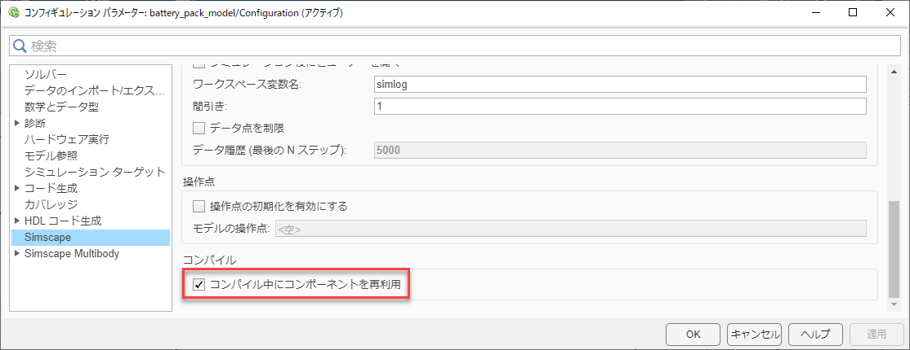

# バッテリーセル96直列のバッテリーパックモデリング
# 目的


多数のバッテリーセルを組み合わせたバッテリーパックを構築する。ここでは、セルを96個直列に接続する。各セルの電圧と温度を計測できるようにする。


# 初期化

```matlab:Code
model_name = 'battery_pack_model';
```

# モデル


以下のコマンドを実行してモデルを開き、構造を確認すること。


```matlab:Code
open_system(model_name);
```


サブシステムを用いて階層化を行い、モデリングの効率化を図っている。同じ構造であるサブシステムはサブシステム参照により、一つのモデルを参照するように設定している。これにより、変更があった際にそのモデルを修正することで全てのサブシステム参照に変更を反映させることができる。


# 実行、結果の確認


モデルを実行し、シミュレーションデータインスペクターで結果を確認する。


```matlab:Code
sim(model_name);
plot_battery_pack_results_in_SDI;
```


抵抗負荷に電流が流れ、SOCが低下していく様子が確認できる。また、セルの温度も上昇していることが分かる。


# 【参考情報】コンパイルの最適化


今回のモデルのように、同じモデリングパターンを繰り返し用いる大規模モデルでは、コンフィギュレーションパラメーターで以下のように設定を行うことで、コンパイル時間を削減することができる。





この設定の詳細については、「[スケーラブルなコンパイルに向けたモデルの準備](https://jp.mathworks.com/help/physmod/simscape/ug/preparing-your-model-for-scalable-compilation.html)」を参照。


  


*Copyright 2022 The MathWorks, Inc.*


