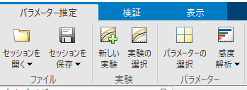

# バッテリー等価回路のパラメーター推定
# 目的


バッテリーの等価回路のパラメータに対して、実験データを元にパラメータ推定を行う。


# 初期化

```matlab:Code
model_name = 'battery_parameter_estimation';
```

# モデル


以下のコマンドを実行してモデルを開くこと。


```matlab:Code
open_system(model_name);
```


モデルでは、バッテリーに対して理想電流源が接続されており、決められたパターンで電流が流れるように構成されている。


モデルを実行し、シミュレーションデータインスペクターで結果を確認する。初期のパラメーターでは、実験データの電圧と一致していないことがわかる。


```matlab:Code
simout = sim(model_name);
plot_battery_param_est_results_in_SDI;
```

# パラメーター推定


Simulink Design Optimization™のパラメーター推定器アプリを用いてパラメーター推定を行う。「アプリ」タブから「パラメーター推定器」をクリックして起動する。


「パラメーター推定」タブの「パラメーターの選択」をクリックする。


開いたウィンドウの「パラメータの選択」をクリックする。


推定したい変数を選択する。ここでは「Em_est」「R0_est」「R1_est」「tau1_est」 を選択し、OKをクリックする。


次に、各変数の推定範囲の最大値、最小値、スケールを指定することができる。


※探索を効率よく行うために、最小値と最大値は可能な限り指定すること。スケールは必ずしも設定する必要はないが、単位系によって数値のスケールが大きく異なる場合は設定すべきである。例えば、電圧が100V程度のスケールである場合、100と入力する。


設定後、OKをクリックする。


次に「新しい実験」をクリックする。





シミュレーションデータインスペクターにログされている信号が自動的に選択されている。ここでは「voltage_sim」を実験値と一致させたいので、この信号のみ残し、他の信号はxボタンをクリックして削除すること。


「voltage_sim」に対する実験値を入力する。モデルを1度実行した後であれば、以下のように入力し、Enterキーを入力することで設定できる。


（入力するコマンド: simout.logsout.get('voltage_exp').Values）


「プロットとシミュレーション」をクリックすると、現時点のシミュレーションモデルの実行結果と実験値を比較できる。設定後、OKをクリックする。


「推定」ボタンをクリックして推定を開始する。


この時、モデルを繰り返し実行するので、高速リスタートをONにしておくことでビルド作業を省略し、推定時間を短縮できる。以下のコマンドで高速リスタートを設定できる。


```matlab:Code
set_param(model_name, 'FastRestart', 'on');
```


すでに設定済みのセッションファイルも用意している。以下のコマンドを実行すると、設定済みセッションを開くことができる。


```matlab:Code
spetool('battery_parameter_estimation_spesession.mat');
```


また、以下のスクリプトを実行することで、予めパラメータ推定器アプリで推定したパラメータをモデルに適用することができる。Simulink Design Optimization™ がインストールされていない場合は、こちらのパラメータを適用して推定後の結果を確認すること。


```matlab:Code
switch_battery_data_to_estimated;
```

# 推定結果の確認


推定完了後、モデルを実行し、結果を確認する。実験データとシミュレーションモデルの波形が一致していることが分かる。


```matlab:Code
sim(model_name);
plot_battery_param_est_results_in_SDI;
```

  


*Copyright 2022 The MathWorks, Inc.*


