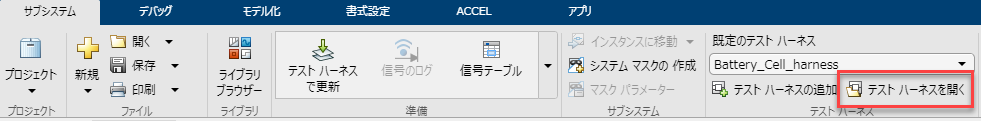
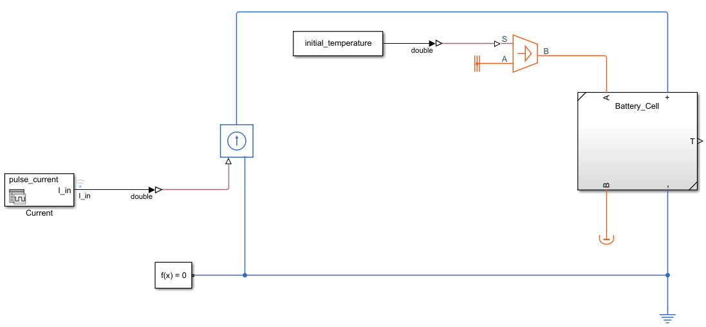
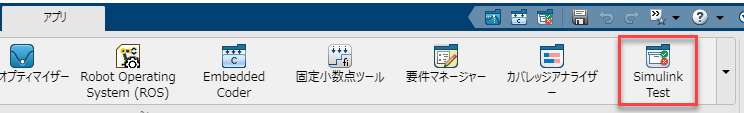
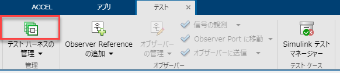
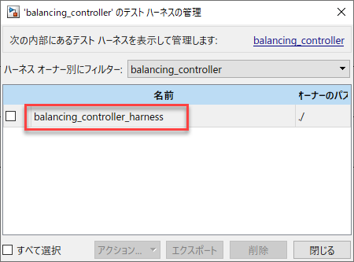
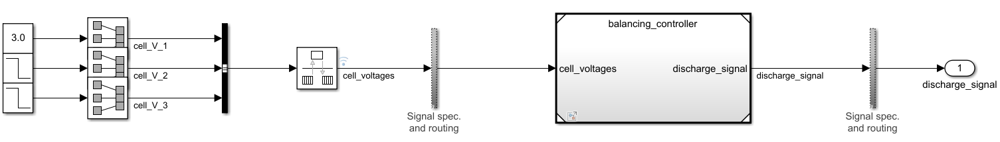

# バッテリーパック充電時におけるパッシブバランス制御
# 目的


3S-1Pバッテリーパックの充電時にセル充電量のアンバランスを解消する制御を行う。


# 初期化

```matlab:Code
system_model_name = 'passive_balancing_system';
controller_model_name = 'balancing_controller';
```

# モデル


以下のコマンドを実行してモデルを開くこと。


```matlab:Code
open_system(system_model_name);
```


「battery_plant_model」サブシステムは制御対象のバッテリーパックである。ここではバッテリーの充電は簡単化し、一定の電流で充電するものとする。


「Controller」参照モデルは制御モデルであり、「balancing_controller.slx」を参照している。バッテリーからセルごとの電圧を計測し、各セルに対して放電するかどうかのフラグを出力している。


「balancing_controller.slx」にはテストハーネス「balancing_controller_harness」が付いており、制御モデル単体で動作検証を行うことができる。


# 実行、動作結果の確認


モデルを実行し、シミュレーションデータインスペクターで結果を確認する。一定の電流で充電する過程で、セルのアンバランスが解消されていることがわかる。


```matlab:Code
sim(system_model_name);
plot_passive_balansing_results_in_SDI;
```

# コード生成


制御モデル「balancing_controller.slx」は、Embedded Coder®によるCコード生成に対応している。以下のコマンドを実行し、モデルから生成されるCコードを確認すること。


```matlab:Code
open_system(controller_model_name);
slbuild(controller_model_name);
```

# テストハーネス


複雑な、または大規模なモデルを作成する際は、モデルの設計ミスに気づきにくくなり、不具合調査に時間がかかることが多い。そこで、モデル内の各要素をサブシステム化し、そのサブシステムごとに実行して、動作を確認しながらモデルを構築することを勧める。


Simulink Test™ の「テストハーネス」という機能を使うと、サブシステムごとにテストをする作業を効率化できる。


## バッテリーセルの単体検証


バッテリーセル単体をモデル化した参照サブシステム「Battery_Cell.slx」を開く。


```matlab:Code
open_system('Battery_Cell.slx');
```


このサブシステムには「Battery_Cell_harness」という名前のテストハーネスが関連付けられている。テストハーネスは、通常のサブシステム以外にも、参照サブシステム、参照モデル（モデル全体）に対しても関連付けることができる。


「サブシステム」タブの「テストハーネスを開く」をクリックして、「Battery_Cell_harness」を開いて確認する。





「Battery_Cell_harness」は、「Battery_Cell.slx」を参照して実行できる、独立したモデル環境である。以下のように、サブシステムの外側にテスト用のブロックを接続し、実行して動作を確認することができる。





サブシステムの外側のブロックを編集したり、モデルを実行する場合は、元の「Battery_Cell.slx」には影響を与えることはない。サブシステムの内側を編集すると、元の「Battery_Cell.slx」も合わせて修正される。これにより、実行しながらサブシステム単体を改善していくことが可能になる。


テストハーネスモデルは、サブシステムに紐づいて保存される。通常のサブシステムであれば、そのサブシステムを含むモデルファイルの中に保存される。参照サブシステム、参照モデルであれば、そのモデルファイルに保存される。


## 制御モデルの単体検証


制御モデル「balancing_controller.slx」にもテストハーネスを作成している。これを使うことで、プラントモデルに接続する前に動作確認を行うことができる。


```matlab:Code
open_system(controller_model_name);
```


「アプリ」タブから「Simulink Test」をクリックして、「テスト」タブを開く。





「テストハーネスの管理」をクリックし、「balancing_controller_harness」をクリックする。








これにより、テストハーネスモデル「balancing_controller_harness」が開く。





モデルを実行し、動作を確認すること。


  


*Copyright 2022 The MathWorks, Inc.*


