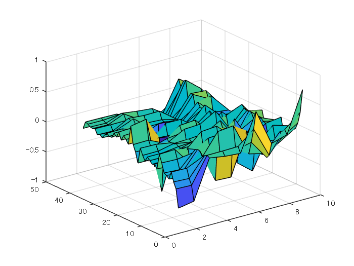
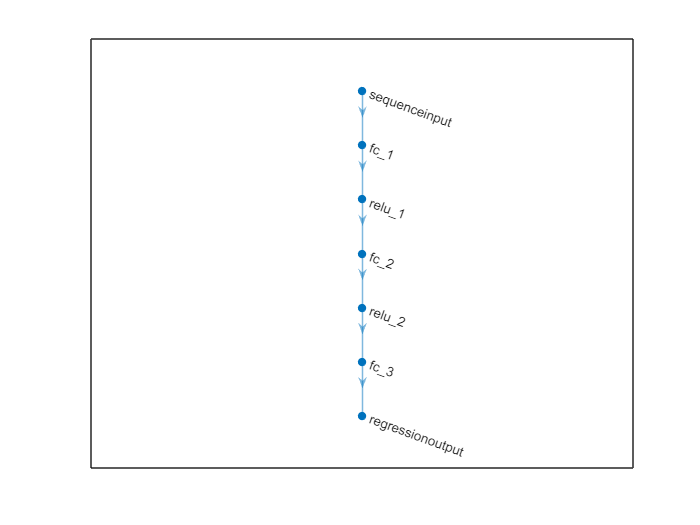
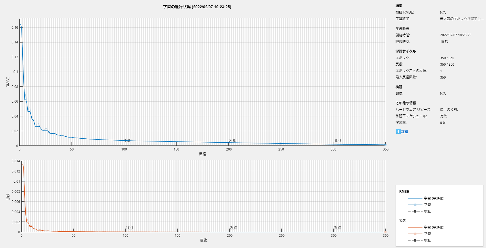
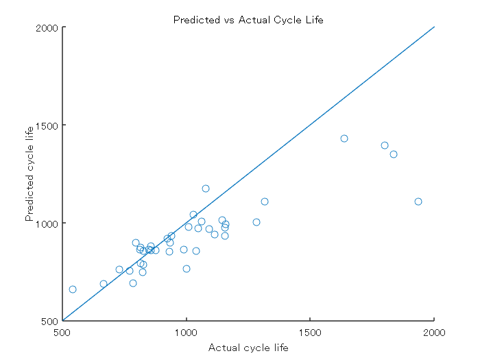

# 深層学習を用いたバッテリーサイクル寿命の予測


本サンプルでは、「機械学習を用いたバッテリー サイクル寿命の予測」で行ったモデル化を、機械学習ではなく深層学習で行う場合の例を紹介する。


# データセットを読み込む


詳細については、「機械学習を用いたバッテリー サイクル寿命の予測」を参照。


```matlab:Code
if ~exist('batteryDischargeData.mat', 'file')
    url = 'https://ssd.mathworks.com/supportfiles/predmaint/batterycyclelifeprediction/v1/batteryDischargeData.zip';
    websave('batteryDischargeData.zip',url);
    unzip('batteryDischargeData.zip');   
end
load('batteryDischargeData.mat');
```

# 学習で用いる特徴量

```matlab:Code
[XTrain,yTrain] = helperGetFeatures(trainData);
head(XTrain)
```

| |DeltaQ_var|DeltaQ_min|CapFadeCycle2Slope|CapFadeCycle2Intercept|Qd2|AvgChargeTime|MinIR|IRDiff2And100|
|:--:|:--:|:--:|:--:|:--:|:--:|:--:|:--:|:--:|
|1|-5.0839|-1.9638|6.4708e-06|1.0809|1.0753|13.4092|0.0168|-3.3898e-05|
|2|-4.3754|-1.6928|1.6313e-05|1.0841|1.0797|12.0251|0.0161|4.4186e-05|
|3|-4.1464|-1.5889|8.1708e-06|1.0800|1.0761|10.9678|0.0159|-1.2443e-04|
|4|-3.8068|-1.4216|-8.4910e-06|1.0974|1.0939|10.0251|0.0161|-3.7309e-05|
|5|-4.1181|-1.6089|2.2859e-05|1.0589|1.0538|11.6689|0.0160|-3.0445e-04|
|6|-4.0225|-1.5407|2.5969e-05|1.0664|1.0611|10.7977|0.0165|-2.4655e-04|
|7|-3.9697|-1.5077|1.7886e-05|1.0762|1.0721|10.1469|0.0162|2.2163e-05|
|8|-3.6195|-1.3383|-1.0356e-05|1.0889|1.0851|9.9247|0.0162|-6.6087e-05|


深層学習では、学習の安定化のため、入出力の規格化を行い、データを-1から+1の範囲に収めるべきである。よって、ここで規格化を行う。


```matlab:Code
data_matrix = [XTrain.Variables, yTrain];
mean_vec = mean(data_matrix);
scale_vec = range(data_matrix);

data_matrix_norm = (1 ./ scale_vec) .* (data_matrix - mean_vec);
```


規格化結果の確認する。


```matlab:Code
surf(data_matrix_norm);
```





```matlab:Code
XTrain_norm = data_matrix_norm(:, 1:8);
yTrain_norm = data_matrix_norm(:, end);
```

# 深層ネットワークを作成

```matlab:Code
numInputs = 8;
numOutputs = 1;
numHiddenUnits = 100;

layers = [ ...
    sequenceInputLayer(numInputs)
    fullyConnectedLayer(numHiddenUnits)
    reluLayer
    fullyConnectedLayer(numHiddenUnits)
    reluLayer
    fullyConnectedLayer(numOutputs)
    regressionLayer];

plot(layerGraph(layers));
```




# 学習オプションを定義

```matlab:Code
maxEpochs = 350;
miniBatchSize = 20;

options = trainingOptions('adam', ...
    'MaxEpochs',maxEpochs, ...
    'MiniBatchSize',miniBatchSize, ...
    'InitialLearnRate',0.01, ...
    'GradientThreshold',1, ...
    'Shuffle','never', ...
    'Plots','training-progress',...
    'Verbose',0);
```

# 学習

```matlab:Code
net = trainNetwork(XTrain_norm', yTrain_norm', layers, options);
```




# テストデータの準備

```matlab:Code
[XTest, yTest] = helperGetFeatures(testData);

data_matrix_test = [XTest.Variables, yTest];
data_matrix_test_norm = (1 ./ scale_vec) .* (data_matrix_test - mean_vec);
XTest_norm = data_matrix_test_norm(:, 1:8);
```

# 性能評価


「機械学習を用いたバッテリー サイクル寿命の予測」と同じようにテストデータを用いて性能を評価する。


```matlab:Code
yPredTest_DL_norm = predict(net, XTest_norm');
yPredTest_DL = scale_vec(end) * yPredTest_DL_norm + mean_vec(end);

figure;
scatter(yTest, yPredTest_DL)
hold on;
refline(1, 0);
title('Predicted vs Actual Cycle Life')
ylabel('Predicted cycle life');
xlabel('Actual cycle life');
```





RMS誤差は以下のようになる。


```matlab:Code
errTest = (yPredTest_DL' - yTest);
rmseTestModel = sqrt(mean(errTest.^2))
```


```text:Output
rmseTestModel = 200.3954
```


平均百分率誤差[1]


を計算すると以下のようになる。


```matlab:Code
n = numel(yTest);
nr = abs(yTest - yPredTest_DL');
errVal = (1/n)*sum(nr./yTest)*100
```


```text:Output
errVal = 10.5085
```

# Simulink実装
## 初期化

```matlab:Code
system_model_name = 'RUL_system_DL';
controller_model_name = 'predict_RUL_with_DL';

% XTest, yTestをSimulinkで扱えるように時系列化する
XTest_signal = timeseries;
XTest_signal.Time = 0:size(XTest, 1) - 1;
XTest_signal.Data = XTest.Variables;
yTest_signal = timeseries;
yTest_signal.Time = 0:size(yTest, 1) - 1;
yTest_signal.Data = yTest;
```


学習させたモデルはSimulinkに実装し、コード生成することができる。学習済み深層ネットワークオブジェクトであるnetを「save」コマンドでmatファイルに保存する。


```matlab:Code
save('trainedNetwork.mat', 'net');
```


Simulinkモデルを確認する。


```matlab:Code
open_system(system_model_name);
```


「predict_RUL_with_DL.slx」にて Predict ブロックを用いて深層ネットワークを呼び出している。


モデルを実行し、結果を確認する。


```matlab:Code
sim(system_model_name);
```

#  コード生成


深層ネットワークは Embedded Coder® でコード生成することができる（ただし、一部コード生成に対応していないレイヤーも存在する）。以下のコマンドを実行し、生成されるコードを確認すること。


```matlab:Code
slbuild(controller_model_name);
```

  
# **参考資料**


[1] Severson, K.A., Attia, P.M., Jin, N. *et al.* "Data-driven prediction of battery cycle life before capacity degradation." *Nat Energy* **4, **383–391 (2019). https://doi.org/10.1038/s41560-019-0356-8


[2] [https://data.matr.io/1/](https://data.matr.io/1/) 


  


*Copyright 2022 The MathWorks, Inc.*


