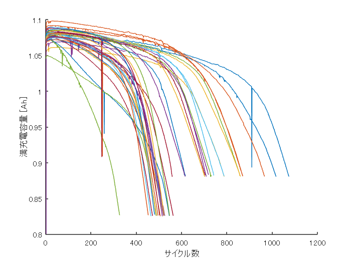
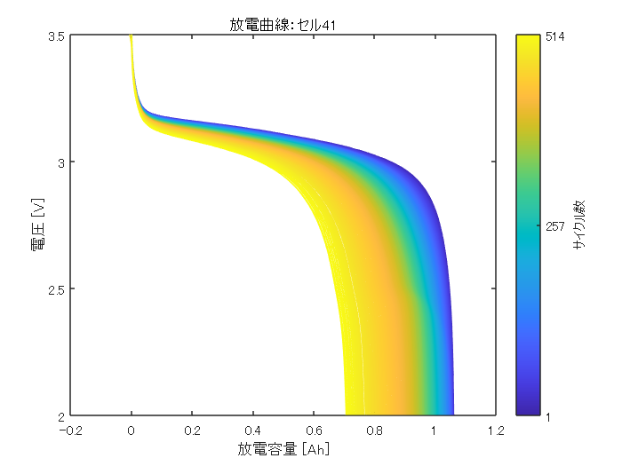
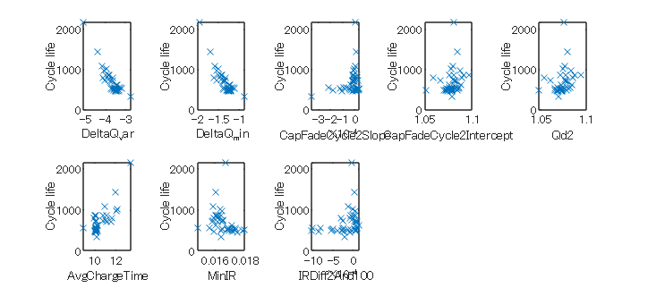

# 機械学習を用いたバッテリーサイクル寿命の予測


本サンプルでは「[初期動作データからのバッテリー サイクル寿命の予測](https://www.mathworks.com/help/predmaint/ug/predict-remaining-cycle-life-of-batteries-from-initial-operation-data.html)」の内容をベースに、回帰学習器でモデル化する例を紹介する。データの詳細については、リンク先を参照すること。


# データセットを読み込む


データセットには、充電と放電のさまざまなプロファイル下で定格容量が 1.1 Ah、定格電圧が 3.3 V の、リチウムイオン電池 124 個の測定値が含まれている。データセット全体にはこちら [2] から、詳細説明にはこちら [1] からアクセスできる。


MathWorks サポートファイルサイトからデータを読み込む。データは約 1.7 GB の大規模なデータセットであるため、本デモモデルの中には含めていない。下記スクリプトでは、一度「batteryDischargeData.mat」をダウンロードした後は、再度ダウンロードしないようにif文で処理を切り分けている。


```matlab:Code
if ~exist('batteryDischargeData.mat', 'file')
    url = 'https://ssd.mathworks.com/supportfiles/predmaint/batterycyclelifeprediction/v1/batteryDischargeData.zip';
    websave('batteryDischargeData.zip',url);
    unzip('batteryDischargeData.zip');   
end
load('batteryDischargeData.mat');
```

# 特徴量を抽出


本デモモデルでは、各充放電サイクルごとの満充電容量を測定したデータを用いる。以下のグラフは、学習に用いるバッテリーのデータをプロットしたものである。


```matlab:Code
figure, hold on;
for i = 1:size(trainData,2)
    if numel(trainData(i).summary.cycle) == numel(unique(trainData(i).summary.cycle))
        plot(trainData(i).summary.cycle, trainData(i).summary.QDischarge);      
    end
end
ylim([0.8,1.1]);
ylabel('満充電容量 [Ah]');
xlabel('サイクル数');
```





この図から分かるように、容量劣化は寿命末期付近で加速している。一方で、最初の 100 サイクルで容量劣化はほとんどなく、これ自体はバッテリーのサイクル寿命の予測に適した特徴ではない。そのため、残りのサイクル寿命の予測では、各サイクルの電圧曲線を電池の内部抵抗や温度などの追加の測定値と共に考慮する、データドリブンの手法が必要となる。


参考までに、セル41に関する各サイクルごとの放電曲線を以下に可視化する。


```matlab:Code
cc = parula(numel(trainData(41).summary.cycle));
figure; clf;
for k = 1:numel(trainData(41).summary.cycle)
    plot(trainData(41).cycles(k).Qdlin, trainData(41).Vdlin, 'Color', cc(k,:));
    hold on;
end
hold off;
clrb = colorbar; %* colorbarの追加
set(clrb, 'TickLabels', {'1','257','514'}, 'Ticks', [0,0.5,1]);
clrb.Label.String = 'サイクル数';
xlabel('放電容量 [Ah]');
ylabel('電圧 [V]');
title('放電曲線：セル41');
```




# 学習で用いる特徴量


バッテリーの残寿命を示す特徴量としては、以下の8種類のデータを用いる。


   \item{  の対数分散 (DeltaQ_var) }
   \item{  の対数の最小値 (DeltaQ_min) }
   -  容量劣化曲線の線形近似の勾配、サイクル 2 ～ 100 (CapFadeCycle2Slope) 
   -  容量劣化曲線の線形近似の切片、サイクル 2 ～ 100 (CapFadeCycle2Intercept) 
   -  サイクル 2 での放電容量 (Qd2) 
   -  最初の 5 サイクルの平均充電時間 (AvgChargeTime) 
   -  最小内部抵抗、サイクル 2 ～ 100 (MinIR) 
   -  サイクル 2 と 100 の間の内部抵抗の差 (IRDiff2And100) 


これらのデータを用いる背景については、参考資料[1]を参照すること。


8種類の特徴量を Xtrain に格納し、教師データである残寿命を yTrain に格納する。


```matlab:Code
[XTrain,yTrain] = helperGetFeatures(trainData);
head(XTrain)
```

| |DeltaQ_var|DeltaQ_min|CapFadeCycle2Slope|CapFadeCycle2Intercept|Qd2|AvgChargeTime|MinIR|IRDiff2And100|
|:--:|:--:|:--:|:--:|:--:|:--:|:--:|:--:|:--:|
|1|-5.0839|-1.9638|6.4708e-06|1.0809|1.0753|13.4092|0.0168|-3.3898e-05|
|2|-4.3754|-1.6928|1.6313e-05|1.0841|1.0797|12.0251|0.0161|4.4186e-05|
|3|-4.1464|-1.5889|8.1708e-06|1.0800|1.0761|10.9678|0.0159|-1.2443e-04|
|4|-3.8068|-1.4216|-8.4910e-06|1.0974|1.0939|10.0251|0.0161|-3.7309e-05|
|5|-4.1181|-1.6089|2.2859e-05|1.0589|1.0538|11.6689|0.0160|-3.0445e-04|
|6|-4.0225|-1.5407|2.5969e-05|1.0664|1.0611|10.7977|0.0165|-2.4655e-04|
|7|-3.9697|-1.5077|1.7886e-05|1.0762|1.0721|10.1469|0.0162|2.2163e-05|
|8|-3.6195|-1.3383|-1.0356e-05|1.0889|1.0851|9.9247|0.0162|-6.6087e-05|


上記8種類の特徴量と残寿命との相関関係を可視化する。


```matlab:Code
for i = 1:size(trainData,2)
    cycleLife(i) = size(trainData(i).cycles,2) + 1;
end

figure('Units','Normalized','Position',[0.05, 0.25, 0.80, 0.65]);
tiledlayout(2,5);
for k = 1:size(XTrain,2)
    feat = XTrain{:,k};
    nexttile;
    plot(feat,cycleLife,'x');
    xlabel(XTrain.Properties.VariableNames(k)); ylabel('Cycle life');
end
```




# 機械学習


ここで、回帰学習器アプリを用いて学習を行う。MATLABの「アプリ」タブから「回帰学習器」をクリックして起動する。


起動後、「新規セッション」と書かれたボタンの「+」部分をクリックする。


「ワークスペースからの新規セッション」ウィンドウにて、データセット変数をXTrainに、応答を「ワークスペースから」を選択し、yTrainに指定する。指定後、「セッションの開始」をクリックする。


「モデルタイプ」セクションの三角形ボタンをクリックする。展開された項目の中の「すべてのクイック学習」をクリックする。


「学習」をクリックする。


いくつかの基本的なモデルで学習が行われており、線形回帰モデルが最もRMS誤差が小さいことがわかる。必要であれば他のモデルを選択し、学習を実行してもよい。


学習済みモデルとして出力したいモデルを選択し、「モデルのエクスポート」のチェックマークをクリックする。変数名を指定してワークスペースに保存する。


ここでは線形回帰を選択し、名前を「trainedModel」とした。


回帰学習器で作成した機械学習モデルを再度作成したい場合、以下のコードを実行することで再現することができる。このコードは回帰学習器アプリの「関数の生成」ボタンから生成することができる（ただし、以下のコードは生成されたものから少し修正を加えている）。


```matlab:Code
% 予測子と応答の抽出
% このコードは、データを処理して、モデルに学習させるのに適した
% 形状にします。
inputTable = XTrain;
predictorNames = {'DeltaQ_var', 'DeltaQ_min', 'CapFadeCycle2Slope', ...
    'CapFadeCycle2Intercept', 'Qd2', 'AvgChargeTime', 'MinIR', 'IRDiff2And100'};
predictors = inputTable(:, predictorNames);
response = yTrain;

% 回帰モデルの学習
% このコードは、すべてのモデル オプションを指定してモデルに学習させます。
concatenatedPredictorsAndResponse = predictors;
concatenatedPredictorsAndResponse.yTrain = response;
linearModel = fitlm(...
    concatenatedPredictorsAndResponse, ...
    'linear', ...
    'RobustOpts', 'off');

% 関数 predict で結果の構造体を作成
predictorExtractionFcn = @(t) t(:, predictorNames);
linearModelPredictFcn = @(x) predict(linearModel, x);
trainedModel.predictFcn = @(x) linearModelPredictFcn(predictorExtractionFcn(x));
trainedModel.LinearModel = linearModel;

% 予測子と応答の抽出
% このコードは、データを処理して、モデルに学習させるのに適した
% 形状にします。
inputTable = XTrain;
predictorNames = {'DeltaQ_var', 'DeltaQ_min', 'CapFadeCycle2Slope', ...
    'CapFadeCycle2Intercept', 'Qd2', 'AvgChargeTime', 'MinIR', 'IRDiff2And100'};
predictors = inputTable(:, predictorNames);
response = yTrain;
isCategoricalPredictor = [false, false, false, false, false, false, false, false];

% 交差検証の実行
KFolds = 5;
cvp = cvpartition(size(response, 1), 'KFold', KFolds);
% 予測を適切なサイズに初期化
validationPredictions = response;
for fold = 1:KFolds
    trainingPredictors = predictors(cvp.training(fold), :);
    trainingResponse = response(cvp.training(fold), :);
    foldIsCategoricalPredictor = isCategoricalPredictor;

    % 回帰モデルの学習
    % このコードは、すべてのモデル オプションを指定してモデルに学習させます。
    concatenatedPredictorsAndResponse = trainingPredictors;
    concatenatedPredictorsAndResponse.yTrain = trainingResponse;
    linearModel = fitlm(...
        concatenatedPredictorsAndResponse, ...
        'linear', ...
        'RobustOpts', 'off');

    % 関数 predict で結果の構造体を作成
    linearModelPredictFcn = @(x) predict(linearModel, x);
    validationPredictFcn = @(x) linearModelPredictFcn(x);

    % 結果の構造体にさらにフィールドを追加

    % 検証予測の計算
    validationPredictors = predictors(cvp.test(fold), :);
    foldPredictions = validationPredictFcn(validationPredictors);

    % 予測を元の順序で保存
    validationPredictions(cvp.test(fold), :) = foldPredictions;
end

```

# 性能評価


テスト用データには40個のバッテリー計測データが格納されている。学習用データと同じようにデータを取り出す。


```matlab:Code
[XTest,yTest] = helperGetFeatures(testData);
yPredTest = trainedModel.predictFcn(XTest);
```


テスト用データを用いて、機械学習モデルの予測結果と実際の残寿命を比較し、予測の精度評価を行う。


```matlab:Code
figure;
scatter(yTest, yPredTest);
hold on;
refline(1, 0);
title('予測と実際の寿命の比較')
ylabel('予測の残寿命');
xlabel('実際の残寿命');
```


RMS誤差は以下のようになる。


```matlab:Code
errTest = (yPredTest-yTest);
rmseTestModel = sqrt(mean(errTest.^2))
```


```text:Output
rmseTestModel = 209.6028
```


平均百分率誤差[1]


を計算すると以下のようになる。


```matlab:Code
n = numel(yTest);
nr = abs(yTest - yPredTest);
errVal = (1/n)*sum(nr./yTest)*100
```


```text:Output
errVal = 10.8774
```

# Simulink実装
## 初期化

```matlab:Code
system_model_name = 'RUL_system_ML';
controller_model_name = 'predict_RUL_with_ML';

% XTest, yTestをSimulinkで扱えるように時系列化する
XTest_signal = timeseries;
XTest_signal.Time = 0:size(XTest, 1) - 1;
XTest_signal.Data = XTest.Variables;
yTest_signal = timeseries;
yTest_signal.Time = 0:size(yTest, 1) - 1;
yTest_signal.Data = yTest;
```


学習させたモデルはSimulinkに実装し、コード生成することができる。「saveLearnerForCoder」というコマンドを用いることで、Simulinkで扱える形に保存し直すことができる。


```matlab:Code
saveLearnerForCoder(trainedModel.LinearModel, ...
    'trainedModel.mat');
```


Simulinkモデルを確認する。


```matlab:Code
open_system(system_model_name);
```


「predict_RUL_with_ML.slx」にて MATLAB Function ブロックを用いて機械学習モデルを呼び出している。「loadLearnerForCoder」というコマンドでmatファイルからオブジェクトを読み込んでいる。


モデルを実行し、結果を確認する。


```matlab:Code
sim(system_model_name);
```

#  コード生成


機械学習モデルは Embedded Coder® でコード生成することができる。以下のコマンドを実行し、生成されるコードを確認すること。


```matlab:Code
slbuild(controller_model_name);
```

  
# **参考資料**


[1] Severson, K.A., Attia, P.M., Jin, N. *et al.* "Data-driven prediction of battery cycle life before capacity degradation." *Nat Energy* **4, **383–391 (2019). https://doi.org/10.1038/s41560-019-0356-8


[2] [https://data.matr.io/1/](https://data.matr.io/1/) 


  


*Copyright 2022 The MathWorks, Inc.*


